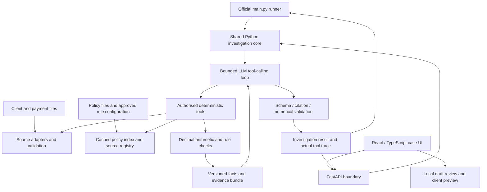

# Payment Clarity — Product Requirements Document

**Payment investigation copilot — clear evidence, clear next action.**

> **Implementation update:** A local evidence-mode application now exists. See [README](README.md) for startup and [VERIFICATION](VERIFICATION.md) for delivered scope. This document remains the target specification; live-provider operation and bank integrations are not validated. The fast prototype uses a standard-library Python server and browser JavaScript in place of FastAPI/React.

| Document field | Value |
| --- | --- |
| Product name | Payment Clarity |
| Project folder | `payment-clarity/` |
| Version | 1.0 · consolidated specification |
| Date | 5 September 2026 |
| Status | Ready for implementation planning; application not implemented |
| Primary users | Payment operations analysts and authorised reviewers |
| Secondary users | Relationship managers (RMs); customers receiving reviewed requests |
| Challenge | Julius Baer sidequest · Use case 1: Payment Investigation Assistant |
| Initial environment | Local prototype using synthetic challenge data |
| Product owner / policy owner | To be assigned before a bank pilot |

Payment Clarity is a working product name, not an assertion of affiliation or trademark availability. Use this name consistently across the application, demo, README, and presentation. Keep the original wealth-advisory project separate.

## 1. Executive decision

Build one complete workflow:

**Select a payment → investigate applicable review requirements → inspect evidence → identify missing information → review an RM handoff and customer request preview.**

The product helps staff reach a defensible next action with less evidence gathering and repeated explanation. It produces an investigation recommendation; authorised bank workflows retain payment decisions.

The first release has two layers: a working investigation core that satisfies the official ten-question runner, and a product UI that presents the same output. Complete the core before investing in UI extensions.

### Product promise

“Payment Clarity helps bank staff investigate payments with less repeated work, ask customers for the right information, and hand over complete cases—with evidence and human review throughout.”

## 2. Problem, evidence, and boundaries

The official challenge describes payment investigation as manual, time-consuming, and inconsistent. Its requested assistant combines structured payment/client data, retrieved policies, deterministic tools, and an LLM. [Source S1]

The challenge does not document Julius Baer's production automation, current processing times, queue sizes, or internal software. Do not claim that JB lacks automated screening, that every payment is handled manually, or that the empty starter functions describe gaps in the bank's systems.

### Specific work to improve

| Work | Potential pain point | Product response | How to verify benefit |
| --- | --- | --- | --- |
| Gather evidence | Records must be joined and checked | One sourced case view | Active retrieval minutes |
| Identify applicable policy | Regional and global requirements overlap | Show applicable rules and calculations together | Correct rule coverage and time spent checking |
| Inspect payment history | Small transfers can form a larger group | Exact grouping with contributing record IDs | Grouping correctness and inspection time |
| Request missing facts | Incomplete requests can cause repeated questions | One consolidated, editable request | Clarification rounds per case |
| Hand over work | Another reviewer reconstructs the investigation | Reusable packet with questions and proposed owner | Rework and review effort |
| Record findings | Repetitive writing and copying | Grounded draft reviewed by a human | Time including edits and verification |

Repeated handoffs and customer frustration are hypotheses to validate through interviews and a pilot, not research findings already established here.

### What “faster” means

Measure active handling time separately from waiting for customers, internal queues, approvals, and external dependencies. The current data cannot establish why a payment was delayed, whether it is held, or when it will settle. The product must not manufacture those answers.

## 3. Goals and non-goals

### Goals

1. Correctly identify review requirements supported by supplied policies and facts.
2. Make every important conclusion inspectable through evidence.
3. Reduce repeated evidence gathering and drafting effort.
4. Make missing information and the proposed next action explicit.
5. Help RMs prepare clear, consolidated customer requests.
6. Demonstrate an integration boundary that can support bank-specific adapters later.

### Non-goals for this release

Payment execution, blocking or release; automated suspicious-activity determinations; regulatory filings; sanctions screening beyond the supplied exercise rule; live settlement tracking; production incident diagnosis; wealth advice; real customer messaging; live document uploads; full bank identity infrastructure; universal system compatibility; production deployment.

The incident-investigation track serves engineers and has no supplied record linkage to these payments. Do not combine it with this MVP.

## 4. Users and responsibilities

| Role | Needs | Product responsibility |
| --- | --- | --- |
| Operations analyst | Understand applicable checks and evidence gaps | Initiate investigation, inspect results, prepare a handoff |
| Authorised specialist reviewer | Assess referred cases with a complete evidence trail | Review recommendation under bank procedure |
| RM | Know exactly what to ask the client | Review/edit the request and customer-safe explanation |
| Customer | Understand what information is requested | View a clear approved request; no real submission in MVP |
| Policy owner | Keep requirements authoritative | Approve rule definitions and versions before a real pilot |
| Integration owner | Maintain reliable source mappings | Validate IDs, permissions, freshness, and reconciliations |

The synthetic dataset contains no actual assignments or approval matrix. UI roles and owners are proposed workflow design. Local role switching is a demo device, not authentication.

## 5. Verified dataset and repository inventory

The copied reference data was audited locally. See `reference-audit.json` and `scripts/audit_reference.py`.

| Item | Verified finding | Design consequence |
| --- | --- | --- |
| Client profiles | 50 rows | Profile count is not user adoption |
| Payments | 184 rows; 47 distinct client IDs | Case events and customers must be counted separately |
| Currency | USD 35, CHF 46, SGD 30, GBP 30, HKD 43 payment rows | Preserve native currency and conversion basis |
| Dates | 2 January–27 July 2026; dates only | Historical records; no true rolling 24-hour timestamps |
| Country mismatch | Seven name/code disagreements | Display disagreements; use documented exercise precedence |
| Structural checks | No duplicate IDs, unknown joins, blank cells, or nonpositive amounts found | Semantic errors can still exist |
| Repeated group | One client/beneficiary/date/currency group, CHF 110,000 | Use as the related-transfer demo |
| AE destinations | 36 payment rows | Exercise review indicator, not confirmed wrongdoing or delayed payments |
| Policies | Nine documents: five relevant, four decoys | Retrieval must select relevant evidence |
| Evaluation | Ten official questions | Exactly one structured result per question |

Missing inputs include live status, hold reason, due time, actual owner, customer documents, response history, approved FX rates, exact payment timestamps, and complete production policy metadata. Show unavailable values explicitly.

### Starter implementation state

`main.py` is an implemented runner that calls `run_agent()` for each question and writes a JSON array. Client/payment tools, retrieval stages, and the agent execution body are empty interfaces. Preserve the upstream runner when implementing the submission. No web UI is supplied. [Sources S2–S4]

## 6. Prioritised scope

| Priority | Capability | Release gate |
| --- | --- | --- |
| P0.1 | Validated client/payment/history tools | Known and unknown IDs handled; exact calculations |
| P0.2 | Relevant policy retrieval and versioned rule checks | Applicable rules are covered with sources |
| P0.3 | Related-payment grouping | Correct membership, total, currency, and date assumptions |
| P0.4 | Bounded LLM tool-calling agent | Grounded answers with actual invocation trace |
| P0.5 | Official runner and output validation | All ten questions produce valid results non-interactively |
| P1.1 | Case workspace and evidence inspection | Four demo cases use real core output |
| P1.2 | RM request editor and review lifecycle | Edits invalidate review; client preview excludes internal findings |
| P1.3 | Visible error, missing-data, and stale-input states | No failed check appears successful |
| P2 | Connected sources and persistent case workflow | Access controls, freshness, ownership, and audit implemented |

P0 is the challenge-core release. P0 + P1 is the product-demo release. P2 requires bank discovery and separate estimation. Do not represent a P0-only artifact as the complete product demo.

## 7. Concrete use cases

All thresholds and destination rules below are supplied synthetic exercise policies. They are not current regulatory advice or representations of JB production policy.

### UC-01 — Below the global threshold, but review is still required

**Payment:** P50002, client C2002, USD 85,000. Client country: Singapore. Beneficiary label: Hong Kong; authoritative code: AE.

**Trigger:** Analyst asks what review applies.

**Checks:** USD 85,000 exceeds Singapore's USD 75,000 RM-review threshold but not the USD 100,000 enhanced-review amount threshold. AE adds destination review. Flag the country mismatch.

**Result:** “RM review and destination review required.” Cite applicable rules and preserve the conflicting fields.

**Next action:** Proposed request for payment purpose, supporting invoice/agreement, beneficiary relationship, and destination confirmation. These are missing facts to request, not facts already established.

**Acceptance:** Correctly apply both applicable requirements without falsely calling the amount an enhanced-review trigger or inferring suspicious intent.

### UC-02 — Related transfers need combined investigation

**Anchor:** P50003, client C2003, Northstar Trading, 11 April 2026.

| Included payment | Native amount |
| --- | ---: |
| P50003 | CHF 45,000 |
| P50180 | CHF 35,000 |
| P50181 | CHF 30,000 |
| Total | CHF 110,000 |

Exclude P50182: different client C2006. Exclude P50183: different beneficiary. Show included and excluded reasoning when inspecting membership.

The exercise treats the same calendar date as the 24-hour window. Comparison with the global USD 100,000-equivalent pattern threshold uses the explicitly disclosed exercise-permitted 1:1 equivalence assumption. Under that assumption the threshold is exceeded, and the supplied Swiss procedure calls for Compliance escalation of potential structuring.

**Result:** “Related payments require pattern review.” Display the assumptions prominently. The pattern is not proof of intent.

**Next action:** Request purpose/documents for each transfer, explanation for separate transfers, and precise times. Production assessment needs approved FX and timestamped records.

### UC-03 — Multiple review requirements, one packet

**Payment:** P50001, C2001, USD 125,000, Singapore client, AE destination.

The amount triggers enhanced review; destination triggers additional review; Singapore RM review also applies. Present the requirements together without assuming one substitutes for another. Operations coordinates the packet; actual approval routing must be supplied by the bank.

**Acceptance:** All requirements remain visible with their evidence; no duplicate customer request is created solely because multiple rules apply.

### UC-04 — Avoid an unsupported escalation

**Payment:** P50000, C2000, USD 12,000, client country UAE, authoritative destination code SG.

The supplied amount and destination checks do not establish an enhanced-review trigger. Complete the relevant history/procedure checks and expose the destination label/code disagreement.

**Result:** “No enhanced-review trigger established by completed checks.” Do not imply that all risks are absent or that the payment is approved for release.

## 8. Process and state model

### Investigation process

1. Validate payment ID and authorisation; retrieve source facts.
2. Resolve client region and available history.
3. Retrieve applicable global, regional, destination, and procedural evidence as needed.
4. Run deterministic checks and preserve calculation inputs.
5. Check evidence coverage; identify unknown or conflicting facts.
6. Let the LLM synthesise a structured recommendation using verified results.
7. Validate citations, numerical statements, and output schema.
8. Present the case for human review and preparation of the next action.

The LLM chooses tools in a bounded loop. An application-level coverage check prevents a final recommendation that omits mandatory applicable checks. Requesting every tool unconditionally is not a substitute for relevant retrieval.

### Separate three kinds of state

- **Check state:** `complete`, `needs_information`, `failed`, `not_applicable`.
- **Investigation state:** `new → running → ready_for_review` or `incomplete`/`failed`.
- **Draft state:** `draft → reviewed` or `rejected`; edits/source changes return it to `draft`.

A complete check may identify a review requirement. “Complete” is not “safe” or “approved”. A reviewed partial draft does not turn an incomplete investigation into a complete one.

A client preview requires review of the current external-text revision. The official non-interactive runner generates investigation recommendations without needing UI approval; that does not authorise external communication.

### Future connected workflow

Persist assignment, request, response, and review events through approved case-management APIs. Do not infer “waiting for customer” from missing data alone. Actual events are required. Preserve separate payment/case identities when combining compatible requests.

## 9. UI and interaction design

### Screen A — Payment investigation list

Show payment ID, amount/currency, review-requirement summary when available, check completeness, and selected case. Search by payment ID. Label historical data and the synthetic environment.

Demo order: P50002 → P50003 → P50001 → P50000. This teaches the four behaviours; it is not a validated risk ranking. Production ordering requires bank-defined urgency, due times, and ownership data.

### Screen B — Case workspace

Use four primary sections:

1. **Required review:** one plain-language headline and individual requirement labels.
2. **Supporting evidence:** facts, source records, applicable rules, and calculations.
3. **Missing information:** explicit unknowns and discrepancies.
4. **Next action:** suggested role and one primary action, “Prepare RM request”.

Desktop: narrow case list, wide case content, evidence drawer on demand. Mobile: selected case first, collapsible payment picker, stacked facts. Keep exact amounts, currency, and dates together.

An evidence item shows source filename/record ID, relevant excerpt, data version, and calculation where applicable. Rule text and transaction facts must be visually distinguishable.

### Screen C — RM handoff and customer preview

The internal handoff contains findings, evidence, assumptions, missing facts, and proposed owner. The external preview contains only approved necessary wording. Use editable fields with visible review state. Do not copy all internal findings into an external draft and depend only on a model instruction to remove them.

Sample proposed request for P50002: “Please confirm the purpose of payment P50002, your relationship with the beneficiary, and the intended destination. Provide a supporting invoice or agreement, if available.” The reviewer decides applicability and allowed disclosure.

### Design rules

- Consistent product name: Payment Clarity; no official-bank branding claims.
- Navy text, restrained teal action emphasis, generous spacing, and readable type.
- Amber highlights unresolved facts; status also has explicit text.
- One primary action per stage; detailed evidence opens on demand.
- Keyboard-accessible controls, visible focus, clear labels, and contrast checks.
- Target WCAG 2.2 AA; test relevant criteria rather than claiming compliance from styling alone. [Source S7]
- No unexplained risk score, fabricated confidence percentage, hidden-chain-of-thought display, or simulated approval.
- Loading text describes actual work: retrieving, calculating, drafting, validating.
- Real failure, empty, stale, and missing-evidence states must be designed alongside success.

`design/ui-concept.html` is a source-checked interactive design reference. Its fixed example logic is not the investigation implementation. It currently demonstrates case switching, source inspection, request editing, and local review invalidation; it is not full conformance with these screen requirements.

## 10. Technical architecture

### Technology decisions

| Component | Choice | Why |
| --- | --- | --- |
| Core | Python | Matches the provided runner and tool interfaces |
| Exact arithmetic | Decimal with explicit currency metadata | Avoid float artefacts and implicit currency mixing |
| File loading | Standard CSV or pandas with validation | Small dataset; simple reproducible imports |
| Retrieval | Local lexical/TF-IDF index | Nine documents do not require vector infrastructure |
| Rules | Reviewed, versioned configuration linked to source clauses | Thresholds and comparisons remain deterministic |
| Agent | One provider-neutral tool-calling LLM adapter | Model handles tool selection and synthesis |
| Validation | Pydantic or equivalent | Structured API/agent output and argument checks |
| API | FastAPI | Thin wrapper around the same core, with documented contracts |
| UI | React + TypeScript | Reusable case, evidence, and review components |
| Demo persistence | Local browser storage for synthetic drafts only | Fast setup; explicitly not a protected audit service |
| Connected pilot | Bank identity, PostgreSQL, approved case APIs | Shared state, access enforcement, durable revision history |

FastAPI supports OpenAPI documentation. Pin supported dependency versions and a lockfile during implementation; no particular model vendor is mandated. [Sources S3, S8]

### Separation of responsibility

Tools perform retrieval, calculations, counts, and grouping. The LLM does not supply authoritative amounts, thresholds, policy versions, or reviewer identity. The application validates conclusions and enforces state transitions. No payment-mutation tool exists.

Policy rule configuration is normal domain logic, not question-keyed answers. Map each configured rule to an inspected source clause and version. A policy change invalidates the rule mapping until reviewed; do not silently let an LLM rewrite executable policy.

## 11. Calculation and retrieval specification

1. Client region is `clients.country`; global policy always applies and regional requirements add to it.
2. “Above” uses strict `>`; a payment equal to a threshold does not trigger that amount rule.
3. `beneficiary_country_code` is authoritative for the exercise; retain the original name and conflict marker.
4. History grouping key is client + beneficiary + calendar date + native currency. For production use stable beneficiary IDs and approved rolling-window semantics.
5. Never add unlike currencies as though they were the same unit. If exercise equivalence is used, record it separately from native totals and display the assumption.
6. Invalid numeric values, duplicate conflicting IDs, missing joins, or unavailable rules make affected checks unresolved. Never convert missing values to zero.
7. Load all supplied policies, preserving source identity. Chunk by headings/rules where possible. Rank by query and applicable context; exclude irrelevant decoys without hard-coding answers to question IDs.
8. Citation IDs must exist in retrieved evidence. A real filename alone is insufficient: the cited clause must support the claim.
9. Render amounts from tools. Validate any numerical prose against authorised facts or replace it with structured numeric fields and qualitative explanation.
10. Source documents and questions are untrusted text; embedded instructions cannot alter tool permissions or validation rules.

## 12. Data contracts

| Entity | Required fields |
| --- | --- |
| PaymentFact | payment_id, client_id, beneficiary_name, destination_code, destination_label, amount, currency, payment_date, source_id |
| ClientFact | client_id, country, risk_rating, client_type, relationship_years, source_id |
| PolicyEvidence | source, clause/chunk_id, text, corpus_version, retrieval metadata |
| CheckResult | check_id, state, requirement, input_refs, evidence_refs, calculation, assumptions, missing_fields |
| Investigation | id, payment_id, input_version, policy_version, status, checks, answer, facts, citations, tools_used |
| RequestDraft | investigation_id, revision, internal_context, external_text, requested_fields, proposed_owner, review_state |
| ReviewEvent | draft_revision, input_version, policy_version, action, reviewer_ref, timestamp |

Only demo identifiers are available for reviewers initially. Production reviewer identity must come from authenticated context. Use a dataset-content hash for the snapshot version; this is provenance, not policy effective-date metadata.

### Official output

Keep exactly one object per official question in the runner's JSON array. Required fields: `question_id`, `payment_id`, `answer`, `citations`, `facts`, `tools_used`; `question` may be included. The runner supplies question identifiers. Actual invocation records determine `tools_used`. [Source S4]

### Proposed UI API

- `POST /v1/investigations`: `{payment_id, question}` → result, versions, check states, assumptions, and missing information.
- `GET /v1/investigations/{id}`: read the authorised result if server persistence is implemented.
- P2 `POST /v1/drafts/{id}/reviews`: `{revision, input_version, policy_version}`; server validates permission and version match.

P1 local reviews do not pretend to be persisted bank reviews. Unknown payment: explicit not-found error. Invalid request: validation error. Dependency/model timeout: structured failure or incomplete result. A citation/number validation failure must not return a successful complete recommendation. Version mismatch rejects review and requires refresh.

## 13. Guardrails and enforcement

| ID | Guardrail | Enforced by | Required behaviour |
| --- | --- | --- | --- |
| G01 | Exact financial facts | Deterministic tools + output validator | Reject unsupported totals, units, dates, or thresholds |
| G02 | Evidence-backed conclusions | Evidence registry + coverage validator | Unsupported check stays unresolved |
| G03 | Missing-data honesty | Input schemas + check state | Unknown is not zero, success, or a passing rule |
| G04 | Policy precedence/versioning | Reviewed rule configuration | Layer applicable requirements; invalidate stale mappings |
| G05 | Prompt-injection resistance | Tool allowlist, argument validation, data boundaries | Ignore document instructions; no arbitrary file/network tools |
| G06 | Human authority | API capability boundaries | No release/block/execute/report-filing tool |
| G07 | No accusation from pattern | Structured finding type + narrative review | Distinguish observations, triggers, assumptions, and recommendation |
| G08 | Client/data isolation | Server authorisation; scoped caches | No cross-client access or result reuse |
| G09 | Customer-safe output | Separate external fields + human review | Exclude internal hypotheses and unnecessary private data |
| G10 | Review integrity | Version-bound state machine | Edits or source changes invalidate review |
| G11 | Controlled model processing | Server secrets and minimum-necessary context | No credentials in browser; no real client data in unapproved provider calls |
| G12 | Failure transparency | Error handling + UI state | Partial facts remain visible; failed checks never appear cleared |
| G13 | Auditability | Actual tool traces and versioned events | Record who reviewed which revision; demo logs labelled as such |

Production deployment needs approved identity/access, data processing, retention, protected audit storage, and policy ownership. These are implementation gates, not capabilities already delivered or a regulatory certification.

## 14. Integration and performance

### Integration stages

1. **Local demo:** supplied files through PaymentSource, ClientSource, and PolicySource adapters.
2. **Read-only pilot:** one authorised payment source and one client source. Preserve source IDs, timestamps, currency, and data versions; reconcile imports.
3. **Workflow connection:** persist approved assignments/requests/reviews with explicit permissions, idempotency, retries, and conflict handling.

An OpenAPI contract makes interfaces understandable; it does not make every bank system compatible. Discover source schemas, permitted data, beneficiary IDs, FX, policy versions, case states, owner mapping, and update frequency before estimating integration. [Source S9]

### Efficiency and nonfunctional targets

- Load/index small local datasets once; cache by source/corpus version.
- Precompute native-currency groups; retain underlying members.
- Fetch independent authorised inputs concurrently where appropriate.
- Share one core between CLI and API; no duplicated browser calculations.
- Proposed interactive target: cached facts/check display within one second; investigation within 30 seconds or visible incomplete/error state.
- Proposed model budget: at most six tool-calling iterations and twelve executed tool calls per investigation, with bounded retries within the overall deadline. Tune if evaluation shows legitimate cases need more.
- Enforce version-aware cancellation: a late response for one payment cannot populate another payment's screen.
- Record elapsed time and model usage without logging secrets or unnecessary source text.

Targets are to be measured during implementation. The official ten-question runner must remain non-interactive and receive an adequate total runtime budget; UI timeouts do not prove successful evaluation.

## 15. Impact and measurement

### Verified demonstration reach

184 payment rows, 50 profiles, and 47 represented clients are synthetic dataset counts. Four demo cases and ten evaluation questions are coverage, not adoption. Multiple payments can form one case, and multiple cases can concern one customer.

### Illustrative operating scenario, not JB measurements

Assume 10 analysts × 10 cases/day × 20 working days = 2,000 case events/month.

| Metric | Assumed baseline | Target scenario | Calculated impact |
| --- | ---: | ---: | ---: |
| Analyst active handling per case, including review | 20 min | 12 min | 8 min saved; 40% reduction |
| Monthly analyst handling | 666.7 h | 400 h | 266.7 h potential capacity |
| Cases needing RM input | 30% | 600 events/month | Workload assumption |
| RM handling per such case | 10 min | 6 min | 40 RM hours/month |
| Avoidable extra customer requests on these 600 cases | 30% | 15% | 180 → 90 requests; 90 fewer |

Do not count RM labour inside analyst time and then add it again. Capacity is not realised payroll saving. Subtract integration, model, hosting, support, and review costs before claiming financial return.

Unique RM/customer reach is unknown until distinct actor IDs are counted. Faster handling does not imply equal improvement in elapsed payment completion. At only three analyst minutes saved per case, the same assumed volume releases 100 hours/month; report sensitivity rather than one guaranteed outcome.

### Pilot plan and gates

Run a formative study with five analysts and 50 balanced cases. Compare current and proposed workflows, balance order to reduce learning effects, and have a domain reviewer assess accuracy. Capture failures and retries rather than excluding them. This sample supports discovery, not broad statistical certainty.

Prioritise: required-review correctness → evidence quality → active handling time → handoff completeness → customer burden → elapsed case time.

Proposed gates: no material missed review requirement in the agreed release test set; all material conclusions supported; no decoy citations in official answers; at least 30% lower median active handling time without increased material errors. Track p90, unnecessary escalation, edits, incomplete requests, and queue/customer waiting separately. Agree thresholds with stakeholders before the pilot.

## 16. Acceptance tests

| ID | Test | Expected result |
| --- | --- | --- |
| T01 | P50002 | Singapore RM and AE reviews shown; no enhanced amount trigger; mismatch visible |
| T02 | C2003 same-beneficiary group | Exactly three expected members; CHF 110,000; both distractors excluded |
| T03 | P50001 | Global/regional amount and destination requirements retained |
| T04 | P50000 | No unsupported enhanced-review claim or release approval |
| T05 | Threshold boundaries | Below/equal/above comparisons use strict source rule semantics |
| T06 | Missing/invalid/conflicting input fixture | Affected check unresolved; no guessed zero or fabricated fact |
| T07 | Mixed currencies/date-only history | Native groups preserved; equivalence/date assumptions disclosed |
| T08 | Relevant retrieval and decoys | Correct supporting clauses retrieved; irrelevant documents not cited |
| T09 | Policy instruction injection | No tool-permission change or arbitrary execution |
| T10 | Unknown citation or numerical hallucination | Validation fails; incomplete/error result shown |
| T11 | Model outage/iteration limit | Bounded failure with verified partial evidence; not false completion |
| T12 | Official runner | Ten schema-valid results; real tool traces; no question-ID answer lookup |
| T13 | Draft reviewed then edited | Reviewed preview invalidated until current revision reviewed |
| T14 | Payment switch during request | Old response cannot overwrite selected case |
| T15 | Narrow/desktop and keyboard UI | Core actions usable at 390/1440 px with labelled focusable controls |
| T16 | P2 authorisation/version conflict | Unauthorised reads denied; stale review rejected |

Passing the ten public questions is not proof of production readiness. Include fixtures that vary amounts, IDs, regions, currencies, and group membership. No automated application tests have been run yet because the core is not implemented.

## 17. Delivery milestones and definition of done

1. **Core facts:** implement validated tools and rule configuration; independently verify calculations.
2. **Grounded agent:** implement cached retrieval, tool loop, validation, and ten-question output.
3. **Case experience:** wire UI to the shared core, then evidence inspection and failure states.
4. **Handoff:** implement editor, version-bound local review, external preview, and client isolation.
5. **Package:** setup instructions, pinned dependencies, environment example without credentials, results, limitations, and demo script.

The official suggested 60 minutes covers the core challenge. It is not a promise that a polished product UI or bank pilot can be built in that hour. Estimate P1 after core validation and P2 after source/approval discovery.

**Core done:** all P0 gates pass, ten results are inspectable, fresh-environment setup works, required LLM usage is genuine.

**Product demo done:** core done plus P1 cases and review flow pass, synthetic assumptions are visible, and the demo does not imply live integration.

**Current package status:** PRD, reference inputs, reproducible audit, and interactive UI concept are provided. Agent, API, production UI, and integrations remain to be built.

## 18. Demo script

- 0:00–0:20: describe manual evidence assembly and the product's next-action promise.
- 0:20–1:05: P50002; show why below-global-threshold still needs review and expose the country mismatch.
- 1:05–1:45: P50003; inspect the three related payments, exclude distractors, and show date/FX assumptions.
- 1:45–2:25: prepare an RM request, edit it, review, and preview customer-safe wording.
- 2:25–2:45: P50000; demonstrate avoidance of unsupported escalation and release claims.
- 2:45–3:00: state measured results if available; otherwise label impact targets as assumptions.

Keep P50001 available for questions about combined review requirements. A fixed UI concept must be described as such; do not present it as live agent output.

## 19. Risks, dependencies, and open questions

| Risk / dependency | Mitigation or decision needed |
| --- | --- |
| Actual JB bottleneck differs from hypothesis | Observe representative workflow; measure where repeat work and waiting occur |
| Complete review/approval matrix unavailable | Obtain policy-owner guidance; keep owners proposed meanwhile |
| FX and timestamps missing | Exercise assumptions explicit; require approved production sources |
| New policies invalidate calculations | Versioned mappings, change review, and stale-result invalidation |
| Real model/API access unavailable | Surface blocker; do not claim a template satisfies the agent requirement |
| Customer disclosure requirements unknown | Keep external preview local until approved process exists |
| Premature UI scope consumes core time | P0 before P1; evidence correctness is the first release gate |
| Model output appears certain despite weak evidence | Coverage and schema validation plus visible incomplete state |

Before a connected pilot resolve target team, existing automation, baseline timings, permitted model/hosting, source access, policy ownership, retention, reviewer roles, and acceptable customer wording. These questions do not block the synthetic P0 build.

## 20. Source record

Repository content was inspected from public main on 5 September 2026. The local snapshot is content-hashed in `reference-manifest.json` but is not pinned to an upstream commit. Recheck submission requirements before submitting. The new Gemini conversation was unread and is not a source.

- **S1:** [Problem statement](https://github.com/Singhacks-2026/juliusbaer-sidequest/blob/main/usecase-1-payment-investigation-agent/PROBLEM_STATEMENT.md)
- **S2:** [Data notes](https://github.com/Singhacks-2026/juliusbaer-sidequest/blob/main/usecase-1-payment-investigation-agent/DATA_NOTES.md)
- **S3:** [Architecture requirements](https://github.com/Singhacks-2026/juliusbaer-sidequest/blob/main/usecase-1-payment-investigation-agent/AI_ARCHITECTURE_REQUIREMENTS.md)
- **S4:** [Submission guide](https://github.com/Singhacks-2026/juliusbaer-sidequest/blob/main/usecase-1-payment-investigation-agent/SUBMISSION_GUIDE.md)
- **S5:** [Policy corpus](https://github.com/Singhacks-2026/juliusbaer-sidequest/tree/main/usecase-1-payment-investigation-agent/data/policies)
- **S6:** [Evaluation criteria](https://github.com/Singhacks-2026/juliusbaer-sidequest/blob/main/usecase-1-payment-investigation-agent/EVALUATION_CRITERIA.md)
- **S7:** [W3C WCAG 2.2 guidance](https://www.w3.org/WAI/standards-guidelines/wcag/new-in-22/)
- **S8:** [FastAPI features](https://fastapi.tiangolo.com/features/)
- **S9:** [OpenAPI overview](https://www.openapis.org/what-is-openapi)

Product design, prioritisation, proposed API, performance limits, guardrails, and impact targets are decisions in this PRD, not official challenge requirements unless explicitly attributed.
